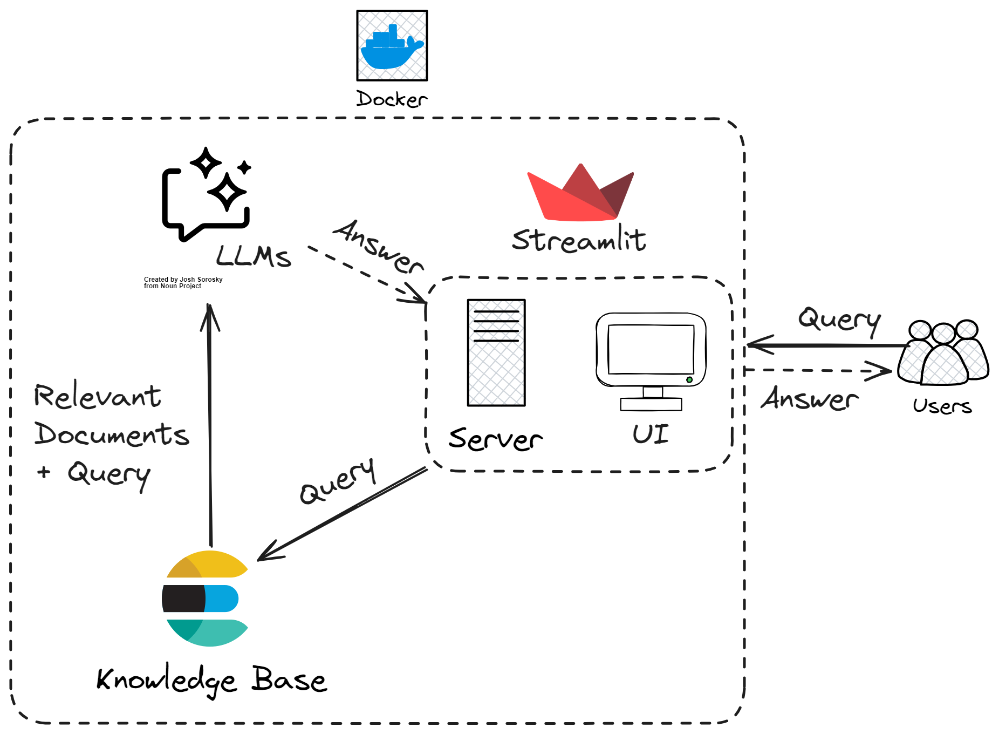

# 1. The Tim Ferriss Show Archivist

**The Tim Ferriss Show (TFS)** is one of the most popular podcast, focusing on "deconstructing world-class performers from eclectic areas (investing, chess, pro sports, etc.), digging deep to find the tools, tactics, and tricks that listeners can use". After 10 years and over 750 episodes, the content has grown to be intimidating to read and search for the gems.

**The TFS Archivist** is a conversational AI that can help users search for the relevant idea from a specific guest/episode, saving the need of manually skimming through the library and the hour-long transcript.

This is my final project for DataTalk.Club's [LLM Zoomcamp](https://github.com/DataTalksClub/llm-zoomcamp) - a free course about LLMs and RAG.

- [1. The Tim Ferriss Show Archivist](#1-the-tim-ferriss-show-archivist)
- [2. Notes](#2-notes)
- [3. Progress](#3-progress)
- [4. Points](#4-points)
- [5. Overview](#5-overview)
- [6. Dataset](#6-dataset)
- [7. App Architecture](#7-app-architecture)
- [8. How to Run the App](#8-how-to-run-the-app)
  - [8.1. `.env` Preparation](#81-env-preparation)
  - [8.2. Database initialization](#82-database-initialization)
  - [8.3. Docker Compose](#83-docker-compose)
  - [8.4. Running Locally](#84-running-locally)
  - [8.5. Docker only](#85-docker-only)
  - [8.6. Using the App](#86-using-the-app)
- [9. Code](#9-code)
- [10. Evaluations](#10-evaluations)
  - [10.1. Retrieval evaluation](#101-retrieval-evaluation)
  - [10.2. RAG model evalution](#102-rag-model-evalution)
- [11. Monitoring](#11-monitoring)
  - [11.1. Dashboard](#111-dashboard)
  - [11.2. Set up](#112-set-up)
- [12. Acknowledgements](#12-acknowledgements)

# 2. Notes

The app was developed on GitHub Codespaces with a disc constraints of 32GB. If the app is set up normally, the machine would actually crash due to disc overflow. To circumvent this, in `docker-compose` file I point the volume to `/tmp/postgres_data` which is a system folder outside the codespace working directory and is not counted towards the 32GB quota. If you are running the app outside of GitHub Codespaces, you may want to this path to just `postgres_data`.

# 3. Progress

- [x] Scrape the data.
- [x] Chunk the data.
- [x] Tokenize the data.
- [x] Ingest the data into an ElasticSearch Docker
- [x] Perform RAG trial with Groq API & Phi-3 (Ollama)
- [x] Build an UI for the app
- [x] Perform Evaluations with GPT-4o
- [x] Build a dashboard for evalution
- [ ] Best practices

# 4. Points

To save you the trouble of looking for the project criteria, I put my marks here. You can double-check while reading through the repo and running it.

Problem description

- [x] 2 points: The problem is well-described and it's clear what problem the project solves

RAG flow

- [x] 2 points: Both a knowledge base and an LLM are used in the RAG flow

Retrieval evaluation

- [x] 2 points: Multiple retrieval approaches are evaluated, and the best one is used

RAG evaluation

- [x] 2 points: Multiple RAG approaches are evaluated, and the best one is used

Interface

- [x] 2 points: **UI (e.g., Streamlit)**, web application (e.g., Django), or an API (e.g., built with FastAPI)

Ingestion pipeline

- [x] 2 points: Automated ingestion with **a Python script** or a special tool (e.g., Mage, dlt, Airflow, Prefect)

Monitoring

- [x] 2 point: User feedback is collected and there's a dashboard with at least 5 charts

Containerization

- [x] 2 points: Everything is in docker-compose

Reproducibility

- [x] 2 points: Instructions are clear, the dataset is accessible, it's easy to run the code, and it works. The versions for all dependencies are specified.

Best practices

- [ ] Hybrid search: combining both text and vector search (**at least evaluating it**) (1 point)
- [ ] Document re-ranking (1 point)
- [ ] User query rewriting (1 point)

# 5. Overview

The TFS Archivist lets user search for a specific content from an episode of The Tim Ferriss Show.

Example use case incluces

1. Search for background information about a guest.
2. Search for the episode a guest appears in.
3. Search for a specific idea that a guest mentioned in the show.

# 6. Dataset

The dataset is the show transcripts up to episode 766, scraped from https://tim.blog/2018/09/20/all-transcripts-from-the-tim-ferriss-show/. The notebook to process the data is in the `scrape` folder. The notebook was run on Colab (to make use of the GPU) across different sessions, so it can be messy. The basic steps:

1. Get all the transcripts, in legacy format (PDF) and current format (web content).
2. Process to extract out the episode content itself.
3. Chunk each episode into chunks of 700 words with 20 words overlapped.
4. Use SentenceTransformer to embed each chunk into 768 dense vectors.

After processing, the data has the following fields:

1. `id`: The episode number.
2. `chunk_id`: The chunk ID in format `id_{auto-increment number}`.
3. `title`: Episode title
4. `chunk`: The text in the chunk.
5. `embedding`: The embedding vector of the text chunk.

> **Note:** Based on the clear copyright prominently displayed in his website (e.g., [here](https://tim.blog/2018/06/27/the-tim-ferriss-show-transcripts-brandon-stanton/)), commercial usage of his transcript is disallowed. It means that you cannot take an app like this and deploy it on cloud for commercial use.

# 7. App Architecture



Technologies used:

- Python 3.12
- Docker and Docker Compose for containerization
- ElasticSearch for full-text search (and semantic search during evaluation)
- Streamlit as both the app backend and frontend
- PostgreSQL as the backend for monitoring (I ran out of disk space for Grafana 🥲)
- OpenAI and Groq as possible LLMs

# 8. How to Run the App

## 8.1. `.env` Preparation

Prepare a `.env` file with the following format

```.env
GROQ_API_KEY=your_api_key
OPENAI_API_KEY=your_api_key

TZ=Asia/Singapore

# PostgreSQL Configuration
POSTGRES_HOST=postgres
POSTGRES_DB=tfs_archivist
POSTGRES_USER=admin
POSTGRES_PASSWORD=admin
POSTGRES_PORT=5432

# Grafana Configuration
GRAFANA_ADMIN_USER=admin
GRAFANA_ADMIN_PASSWORD=admin
GRAFANA_SECRET_KEY=SECRET_KEY

# Elasticsearch Configuration
ELASTIC_URL_LOCAL=http://127.0.0.1:9200
ELASTIC_URL=http://elasticsearch:9200
ELASTIC_PORT=9200

# Streamlit Configuration
STREAMLIT_PORT=8501
```

Get your Groq and OpenAI API keys from respective website. 

## 8.2. Database initialization

The database for ElasticSearch and PostgreSQL needs initializing before running the app.

First, run the postgres and elasticsearch containers only

```bash
docker-compose up postgres elasticsearch -d
```

Second, prepare the Python environments and run the `prep.py` and `ingestion.py` scripts

```bash
conda create -n llm
conda activate llm
pip install -r requirements.txt

export POSTGRES_HOST=localhost
python prep.py
python ingestion.py
```

## 8.3. Docker Compose

The easiest way is to use Docker Compose. **After database initialization**, run

```bash
docker-compose up
```

## 8.4. Running Locally

If you want to run the application locally, **after database initialization**, instead of `docker-compose up`, run

```bash
export POSTGRES_HOST=localhost
bash streamlit.sh
```

## 8.5. Docker only

If you want to run the application using only Docker for development, **after database initialization**, build the image and run it

```bash
docker build -t streamlit .
docker run -it --rm \
    --network="llm-zoomcamp-tf-show-archivist_default" \
    --env-file=".env" \
    -e OPENAI_API_KEY=${OPENAI_API_KEY} \
    -e GROQ_API_KEY=${GROQ_API_KEY} \
    -p 8501:8501 \
    app
```

## 8.6. Using the App

Navigate to http://127.0.0.1:8501/ to use the app via the Streamlit UI.

Demo can be viewed at 

<div>
  <a href="https://www.loom.com/share/1c3e150ea6c04e9bb21f13c295e201d3">
    <p>LLM Zoomcamp Demo - Watch Video</p>
  </a>
  <a href="https://www.loom.com/share/1c3e150ea6c04e9bb21f13c295e201d3">
    
  </a>
</div>

https://www.loom.com/share/1c3e150ea6c04e9bb21f13c295e201d3

# 9. Code

- `grafana` - Initialization and dashboard settings for Grafana dashboards.
- `notebooks` - contain experiment notebooks and first prototype
- `scrape` - contain notebook used to scrape and process the data
- `utils` - util functions
- `app.py` - the main app logic
- `assistant.py` - the main RAG logic for building the retrieving the data and building the prompt
- `ingestion.py` - loading the data into the knowledge base
- `db.py` - the logic for logging the requests and responses to postgres database
- `prep.py` - the script for initializing the database

# 10. Evaluations

> **Note:** Due to a gross mistake on my part during transfer between different GitHub Codespace (I broke the last one), the experiment data were lost. Only the data as the output of the notebooks remain 😔.

2 Jupyter notebooks in the `notebooks` folder.

- `evaluation_data_generation.ipynb` - Ground truth dataset generation.
- `evaluation_rag.ipynb` - The retrieval and RAG evaluation.

## 10.1. Retrieval evaluation

Vector approximate search (10,000 sample (max setting for ElasticSearch), top-5, cosine similarity)

- Chunk Hit Rate: 0.3820558526440879,
- Chunk MRR: 0.44081501287383695,
- Document Hit Rate: 0.6316102198455139,
- Document MRR: 0.9488710635769462

Keyword search (chunk and title, no boosting, top-5)

- Chunk Hit Rate: 0.7890671420083185,
- Chunk MRR: 1.0368785898197679,
- Document Hit Rate: 0.8722519310754605,
- Document MRR: 1.571390374331495

Keyword search performed better. Due to time constraint, I did not test boosting for keyword search. To do so, we can use `minsearch.py` as an approximate to perform simple optimization, and then use the setting for ElasticSearch.

## 10.2. RAG model evalution

I evaluated the new `llama-3.1-8b-instant` and the older `llama3-8b-8192` from Groq using GPT-4o-mini as a judge, using 103 samples.

> The odd number of sample is due to rate limit from Groq!

Llama 3:

```bash
relevance
RELEVANT           0.737864
PARTLY_RELEVANT    0.174757
NON_RELEVANT       0.087379
```

Llama 3.1

```bash
relevance
RELEVANT           0.718447
PARTLY_RELEVANT    0.165049
NON_RELEVANT       0.116505
```

Based on the 103 samples, GPT-4o-mini judged that Llama-3 8B has some edge over the new Llama-3.1 8B, though it's just 1-2 questions different. Considering they are both free, I used both.

> A further evaluation would be to try Llama-3 70B to see if the increased size can lead to a better performance, and if it's worth the cost.

# 11. Monitoring

A postgres DB was set up as the backend for monitoring, storing the conversations as well as user feedback. Grafana visualized the information using this data.

When the app is running, access it at localhost:3000:

- Login: "admin"
- Password: "admin"

## 11.1. Dashboard

The dashboard follows the template in the course, with 7 panels

1. **Last 5 Conversations (Table)**: Displays a table showing the five most recent conversations, including details such as the question, answer, relevance, and timestamp. This panel helps monitor recent interactions with users.
2. **+1/-1 (Pie Chart)**: A pie chart that visualizes the feedback from users, showing the count of positive (thumbs up) and negative (thumbs down) feedback received. This panel helps track user satisfaction.
3. **Relevancy (Gauge)**: A gauge chart representing the relevance of the responses provided during conversations. The chart categorizes relevance and indicates thresholds using different colors to highlight varying levels of response quality.
4. **Tokens Cost (Time Series)**: A time series line chart depicting the cost associated with API usage over time for both Groq and OpenAI. This panel helps monitor and analyze the expenditure linked to the AI model's usage.
5. **Tokens (Time Series)**: Another time series chart that tracks the number of tokens used in conversations over time. This helps to understand the usage patterns and the volume of data processed.
6. **Model Used (Bar Chart)**: A bar chart displaying the count of conversations based on the different models used. This panel provides insights into which AI models are most frequently used.
7. **Response Time (Time Series)**: A time series chart showing the response time of conversations over time. This panel is useful for identifying performance issues and ensuring the system's responsiveness.

## 11.2. Set up
All Grafana configurations are in the [`grafana`](grafana/) folder:

- [`init.py`](grafana/init.py) - for initializing the datasource and the dashboard.
- [`dashboard.json`](grafana/dashboard.json) - the actual dashboard (taken from LLM Zoomcamp without changes).

To initialize the dashboard, first ensure Grafana is
running (it starts automatically when you do `docker-compose up`).

Then run:

```bash
export POSTGRES_HOST=localhost
python init.py
```
Then go to [localhost:3000](http://localhost:3000):

- Login: "admin"
- Password: "admin"

# 12. Acknowledgements

I would like to thank DataTalks.Club and all the guests and sponsors for the quality content of the course, all totally free.

And I hope you, the reviewer, enjoyed doing the course as much as I do ⸜(｡˃ ᵕ ˂ )⸝♡