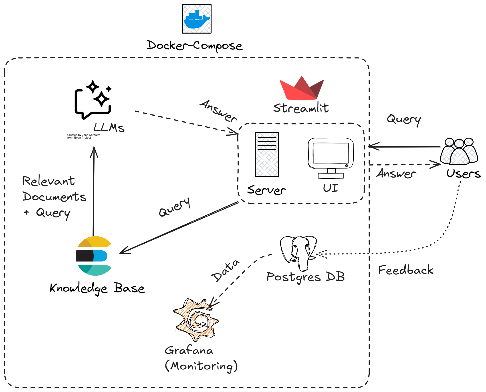

# The Tim Ferriss Show Archivist

**The Tim Ferriss Show (TFS)** is one of the most popular podcast, focusing on "deconstructing world-class performers from eclectic areas (investing, chess, pro sports, etc.), digging deep to find the tools, tactics, and tricks that listeners can use". After 10 years and over 750 episodes, the content has grown to be intimidating to read and search for the gems.

**The TFS Archivist** is a conversational AI that can help users search for the relevant idea from a specific guest/episode, saving the need of manually skimming through the library and the hour-long transcript.

This is my final project for DataTalk.Club's [LLM Zoomcamp](https://github.com/DataTalksClub/llm-zoomcamp) - a free course about LLMs and RAG.

- [The Tim Ferriss Show Archivist](#the-tim-ferriss-show-archivist)
- [Progress](#progress)
- [Points](#points)
- [Overview](#overview)
- [Dataset](#dataset)
- [App Architecture](#app-architecture)
- [How to Run the App](#how-to-run-the-app)
  - [`.env` Preparation](#env-preparation)
  - [Database initialization](#database-initialization)
  - [Docker Compose](#docker-compose)
  - [Running Locally](#running-locally)
  - [Docker only](#docker-only)
  - [Using the App](#using-the-app)
- [Code](#code)
- [Experiments](#experiments)
  - [Embedding length](#embedding-length)
  - [Retrieval evaluation](#retrieval-evaluation)
  - [RAG model evalution](#rag-model-evalution)
- [Monitoring](#monitoring)
- [Acknowledgements](#acknowledgements)

# Progress

- [x] Scrape the data.
- [x] Chunk the data.
- [x] Tokenize the data.
- [x] Ingest the data into an ElasticSearch Docker
- [x] Perform RAG trial with Groq API & Phi-3 (Ollama)
- [x] Build an UI for the app
- [x] Perform Evaluations with GPT-4o
- [ ] Build a dashboard for evalution
- [ ] Best practices

# Points

To save you the trouble of looking for the project criteria, I put my marks here. You can double-check while reading through the repo and running it.

Problem description

- [x] 2 points: The problem is well-described and it's clear what problem the project solves

RAG flow

- [x] 2 points: Both a knowledge base and an LLM are used in the RAG flow

Retrieval evaluation

- [x] 2 points: Multiple retrieval approaches are evaluated, and the best one is used

RAG evaluation

- [x] 2 points: Multiple RAG approaches are evaluated, and the best one is used

Interface

- [x] 2 points: **UI (e.g., Streamlit)**, web application (e.g., Django), or an API (e.g., built with FastAPI)

Ingestion pipeline

- [x] 2 points: Automated ingestion with **a Python script** or a special tool (e.g., Mage, dlt, Airflow, Prefect)

Monitoring

- [x] 1 point: User feedback is collected OR there's a monitoring dashboard

Containerization

- [x] 2 points: Everything is in docker-compose

Reproducibility

- [x] 2 points: Instructions are clear, the dataset is accessible, it's easy to run the code, and it works. The versions for all dependencies are specified.

Best practices

- [ ] Hybrid search: combining both text and vector search (**at least evaluating it**) (1 point)
- [ ] Document re-ranking (1 point)
- [ ] User query rewriting (1 point)

# Overview

The TFS Archivist lets user search for a specific content from an episode of The Tim Ferriss Show.

Example use case incluces

1. Search for background information about a guest.
2. Search for the episode a guest appears in.
3. Search for a specific idea that a guest mentioned in the show.

# Dataset

The dataset is the show transcripts up to episode 766, scraped from https://tim.blog/2018/09/20/all-transcripts-from-the-tim-ferriss-show/. The notebook to process the data is in the `scrape` folder. The notebook was run on Colab (to make use of the GPU) across different sessions, so it can be messy. The basic steps:

1. Get all the transcripts, in legacy format (PDF) and current format (web content).
2. Process to extract out the episode content itself.
3. Chunk each episode into chunks of 700 words with 20 words overlapped.
4. Use SentenceTransformer to embed each chunk into 768 dense vectors.

After processing, the data has the following fields:
1. `id`: The episode number.
2. `chunk_id`: The chunk ID in format `id_{auto-increment number}`.
3. `title`: Episode title
4. `chunk`: The text in the chunk.
5. `embedding`: The embedding vector of the text chunk.

> **Note:** Based on the clear copyright prominently displayed in his website (e.g., [here](https://tim.blog/2018/06/27/the-tim-ferriss-show-transcripts-brandon-stanton/)), commercial usage of his transcript is disallowed. It means that you cannot take an app like this and deploy it on cloud for commercial use.

# App Architecture



Technologies used:
- Python 3.12
- Docker and Docker Compose for containerization
- ElasticSearch for full-text search (and semantic search during evaluation)
- Streamlit as both the app backend and frontend
- PostgreSQL as the backend for monitoring (I ran out of disk space for Grafana 🥲)
- OpenAI and Groq as possible LLMs

# How to Run the App
## `.env` Preparation
Prepare a `.env` file with the following format
```.env
GROQ_API_KEY=your_api_key
OPENAI_API_KEY=your_api_key

TZ=Asia/Singapore

# PostgreSQL Configuration
POSTGRES_HOST=postgres
POSTGRES_DB=tfs_archivist
POSTGRES_USER=admin
POSTGRES_PASSWORD=admin
POSTGRES_PORT=5432

# Grafana Configuration
GRAFANA_ADMIN_USER=admin
GRAFANA_ADMIN_PASSWORD=admin
GRAFANA_SECRET_KEY=SECRET_KEY

# Elasticsearch Configuration
ELASTIC_URL_LOCAL=http://127.0.0.1:9200
ELASTIC_URL=http://elasticsearch:9200
ELASTIC_PORT=9200

# Streamlit Configuration
STREAMLIT_PORT=8501
```
Get your Groq and OpenAI API keys from respective website. 
## Database initialization
The database for ElasticSearch and PostgreSQL needs initializing before running the app.
First, run the postgres and elasticsearch containers only
```bash
docker-compose up postgres elasticsearch -d
```

Second, prepare the Python environments and run the `prep.py` and `ingestion.py` scripts
```bash
conda create -n llm
conda activate llm
pip install -r requirements.txt

export POSTGRES_HOST=localhost
python prep.py
python ingestion.py
```

## Docker Compose
The easiest way is to use Docker Compose. **After database initialization**, run
```bash
docker-compose up
```

## Running Locally
If you want to run the application locally, **after database initialization**, instead of `docker-compose up`, run
```bash
export POSTGRES_HOST=localhost
bash streamlit.sh
```

## Docker only
If you want to run the application using only Docker for development, **after database initialization**, build the image and run it
```bash
docker build -t streamlit .
docker run -it --rm \
    --network="llm-zoomcamp-tf-show-archivist_default" \
    --env-file=".env" \
    -e OPENAI_API_KEY=${OPENAI_API_KEY} \
    -e GROQ_API_KEY=${GROQ_API_KEY} \
    -p 8501:8501 \
    app
```
## Using the App
Navigate to http://127.0.0.1:8501/ to use the app via the Streamlit UI.
Demo can be viewed at 
<div>
  <a href="https://www.loom.com/share/1c3e150ea6c04e9bb21f13c295e201d3">
    <p>LLM Zoomcamp Demo - Watch Video</p>
  </a>
  <a href="https://www.loom.com/share/1c3e150ea6c04e9bb21f13c295e201d3">
    
  </a>
</div>

https://www.loom.com/share/1c3e150ea6c04e9bb21f13c295e201d3


# Code


# Experiments

## Embedding length

## Retrieval evaluation

## RAG model evalution

# Monitoring

# Acknowledgements